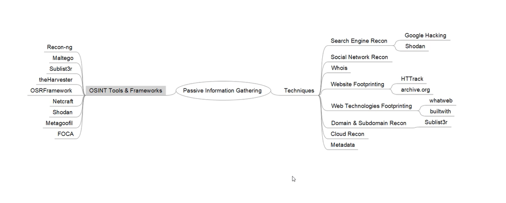
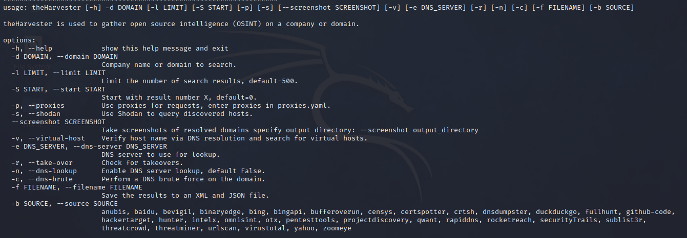
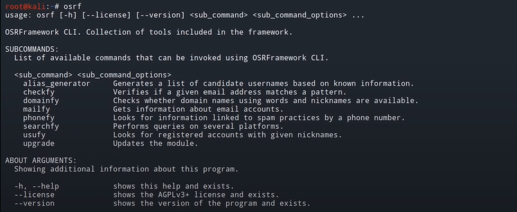
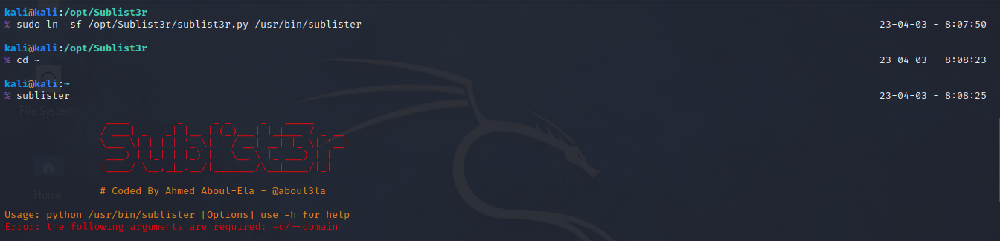
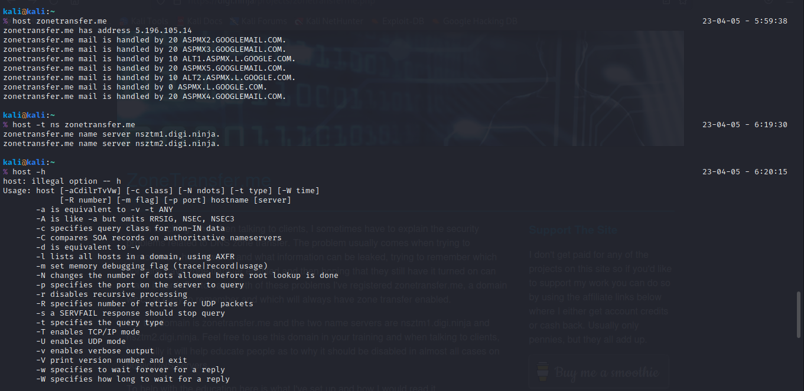
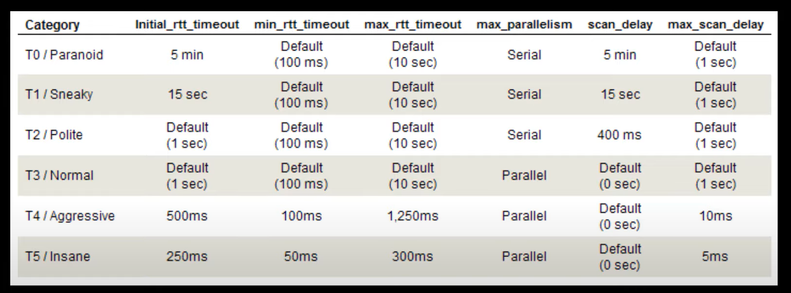

# Information Gathering

First stage in penetration testing. Basically gathering information about target and their systems/servers. Main objective is to make blueprint about the organisation's infrastructure. Makes their overall security infrastructure visible and helps with next steps.  
We usually get -   
* Network & host based info.  
* Employee information.  

## Passive  
Without any direct contact with target's digital infrastructure. Usually using OSINT and openly available info on web.  
  
### Some tools and techniques  

**Whois** - Domain lookup    
It is used to query the databases which stores the registeration information regarding domains. It usually include domain name, IP addresses, registrant name and other info about them etc. Can be used to facilitate social engineering attacks.  

**theHarvester** - Email Harvesting  
Why? Depending on the info looking for, we can use it to collect the email info of the organisation or the person passively.  
  

**Maltego** - OSINT Gathering  

**OSRFramework** - Open Sources Research Framework  
https://github.com/i3visio/osrframework  
  

**Sublister** - Subdomain enumeration



**Google Dorks** - Google Hacking  
Passive info gathering tool which can facillitate data exposure and security misconfigurations in webapps. Some operators for finetuning the search query are listed on below link.  
[Hsploit](https://hackersploit.org/google-hacking-for-penetration-testing/)  

**DNS Enumerations and Zone Transfers**  
DNS records help out layout the digital structure of the domain, could reveal hidden mailservers, hidden servers, etc. Basically quering dns records for domains, looking for ip addresses, mail servers, etc. DNS zone transfer is a legit technique used by admins to ensure redundancy by copying the address to secondary name server from a secondary name server. 
Attacks might be able to copy/zone transfer the records from primary server to an unauthorised server hence obtaining the critical infrastructure layout and info.  
host tool - 
```
dig axfr zonetransfer.me @nameserver
```  
dnsenum - automates the above thing.  
dnsmap - DNS network Mapper.   
```
dnsmap zonetransfer.me -w /usr/share/wordlists/seclists/Discovery/DNS/dns-Jhaddix.txt     
```
Fierce - Similar tool but with a lot more functionality  
Nmap - It also has usable scripts using Nmap scripting engine for DNS  

## Active  
It uses direct contact like using nmap or social engineering or things like that.  

### Scanning  
Usually done after passive scanning or info gathering is done. No exploitation or access is gained in this step but only the access vectors like ports, services and misconfiguratiosn are identified by actually connecting to the attack surface.  

**Network Scanning** - Identifies the active hosts on the network. Used to make detailed map of the network infrastructure.  
**Port Scanning** - Used to enumerate the services running on the target system by sending TCP/UDP packets to their respective port numbers.  

**NMAP!!!!!**
All the list of options and parameters can be found here - [Man page](https://linux.die.net/man/1/nmap)  
All the nmap scripts are found in - /usr/share/nmap/scripts/  

Default scan - 1000 common ports.
```
nmap 192.168.1.1
```
Host discovery using nmap - (Only ICMP ping scan, no ports)
```
nmap -sn 192.168.1.1
```
If ICMP requests are blocked - (Only port scans, skips host discovery)
```
nmap -Pn 192.168.1.1
```
OS + service + specific ports/range of ports or just an aggressive scan which includes all mentioned before and nmap scripts - (Parameters are used in order as mentioned before)
```
nmap -O -sV -p22,80,443 OR -p0-10000 192.168.1.1
nmap -A -p- 192.168.1.1
```
TCP Connect and Open scans - Conducts threeway handshakes and resets the connection at the end of the cycle, so super slow. Easily detectable and prevent through firewalls, Highly accurate though. 
```
nmap -sT -p0-10000 192.168.1.1 
```
Half open or SYN(Stealth) scans - Establish TCP connection but do not let the whole TCP handshake goes through. Sends SYN packet and receive a SYN-ACK if open. If closed then we receive a RST packet. Can evade firewall and makes a bit less sound and doesn't trigger much alarms.  
```
nmap -sS 192.168.1.1
```
UDP Scans - We usually use responses to say for certain if the port is open or not. First send a UDP request to a server on a particular port, if there is no response, the port is open and if response is there, then we will most likely get a ICMP respose saying that the port is closed. Kinda long scan. Firewall can totally ruin the scan by blocking responses as such. 
```
nmap -sU 192.168.1.1
```
Inverse TCP flag Scanning - Flags like FIN and NULL are used, They don't have any relevance to TCP handshake. Used to avoid detection(like from IDS), extremely stealthy. If we don't get a response, then the port is most likely open. But if it is closed we will get an RST/ACK packet. XMAS scans put FIN, URG, PSH flag and bombard target will all three types of packets. It does not work on windows.
```
XMAS scan - nmap -sX 192.168.1.1
FIN - nmap -sF 192.168.1.1
NULL - nmap -sN 192.168.1.1
```
There is an reason option, which lets us know why the result is like that or how nmap decided upon the result.
```
nmap -sX 192.168.1.1 --reason
```

ACK Probing (Firewall Detection) - Sends an ACK TCP request, if there is not response, there is a firewall in place. The traffic if being filtered. If there is an RST response, then there is no firewall in place. Works on all OS unlike inverse TCP scans.
```
nmap -sA 192.168.1.1
```
Firewall Evasion with NMAP - Option 1 : Decoy - Basically spoofing an IP, we can use a specific IP or we can just specify RND(random) with number of IPs where nmap will use random IPs. (IT IS NOT SPOOFING!)
```
nmap -sS -D RND:X 192.168.1.1
```
Option 2 : Fragmentations - As the name suggests, the packets are just split into smaller packets and then are re-assembled into full packets at the target. We can also use --mtu instead of -f and specify the certain length we want. (mtu = Minimum transmission unit)
```
nmap -sS -D RND:X -f/--mtu 8 --send-eth 192.168.1.1
```
Modern firewalls and IDS/IPS will most likely be able to figure out the decoys and will be able to assemble the fragmented packets and read through them. So there might no be 100% success rate.

Usually it is recommended to go slow and scan only the ports which we acutally need. Decoy scans might just alarm the IDS instantly because of anti-spoofing thingy. IDS/IPS is just one thing, there are also SIEMs at place which can detect the irregularities in the flow of the traffic.  

Scan Timings and Performance - 
- Timing Templates - Used to change the speed of scan, usually depends on our requirement and environment restrictions. They range from T0 - T5. They help when rate-limiting or an active IDS/IPS is in place.

- Parallelism - Usually automatically setup when performing scans. Slower scan will most likely won't have parallelism, whereas the faster scan will have more parallelism. More speed/Aggressive scans might lead to inaccuracies. Once again, useful where rate-limiting is enforced and to avoid detection. 
```
nmap -sS --min/max-parallelism 30 192.168.1.1
```
- Host Group Sizes - Allows the size of hosts, like how many hosts are to be scanned simultaneously. 
```
nmap -sS --min/max-hostgroup 5 192.168.1.1/24
```
- Host Timeout - Used to specify the timeout, in which if the target won't respond, nmap will just skip it and continue with the scan.
```
nmap -Pn -p- --host-timeout 30s 192.168.1-255.1-255
```
- Scan Delay - Allows to pause nmap for a specific amount of time between the requests.
```
nmap -sT --scan-delay 5s 192.168.1.1
```
- Packet Rate - Minimum/Maximum amount of packets per second we want to send. WILL alert any defence mechanism if rate is high. As usual, if too aggressive/fast, we might get inaccuracies.  
```
nmap -sT --min/max-rate 20 192.168.1.1
```